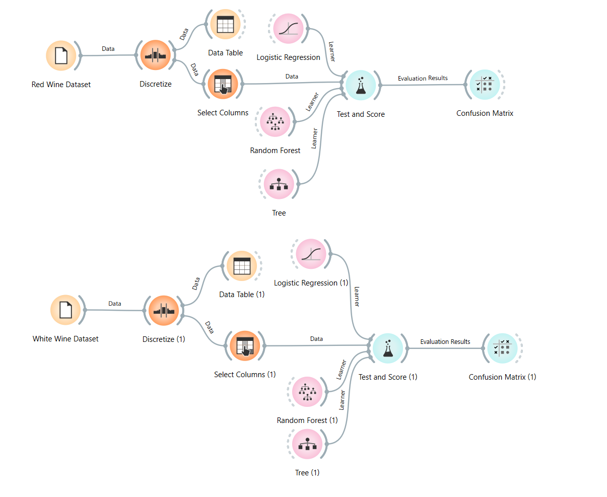

# Wine Quality Classification using Orange

## Project Overview
This project predicts wine quality using machine learning models in Orange Data Mining. The goal is to compare the performance of models on red and white wine datasets.

## Dataset
The dataset contains physicochemical properties of Portuguese Vinho Verde wines.

- Red wine dataset: 1599 samples  
- White wine dataset: 4898 samples  

The target variable `quality` was converted into 3 classes:

- Low quality: < 5  
- Medium quality: 5 - 7  
- High quality: ≥ 7  

## Workflow
The following steps were applied:

1. Data loading  
2. Discretization of quality variable  
3. Feature selection  
4. Model training  
5. Model evaluation using cross-validation  

## Models Used
- Logistic Regression  
- Decision Tree  
- Random Forest  

## Results

| Dataset | Best Model | Accuracy |
|--------|-----------|----------|
| Red Wine | Random Forest | 0.857 |
| White Wine | Random Forest | 0.829 |

## Conclusion
Random Forest performed best on both datasets. The red wine dataset achieved slightly higher accuracy than the white wine dataset.

## Screenshots

### Workflow

### Red Wine Results
.png)

### White Wine Results
.png)

## Project Files
- `wine-quality-final.ows`
- `winequality-red.csv`
- `winequality-white.csv`
- `winequality.names`
- `Screenshots/`

## Dataset Citation
Cortez, P., Cerdeira, A., Almeida, F., Matos, T., & Reis, J. (2009).  
Modeling wine preferences by data mining from physicochemical properties.  
Decision Support Systems, 47(4), 547–553.  
http://dx.doi.org/10.1016/j.dss.2009.05.016
