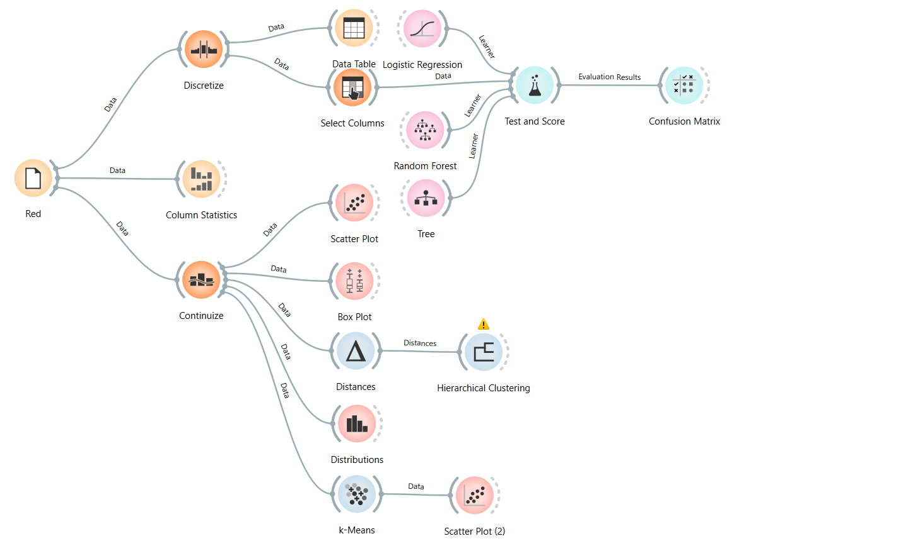
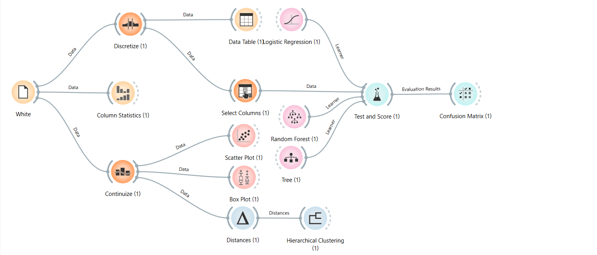
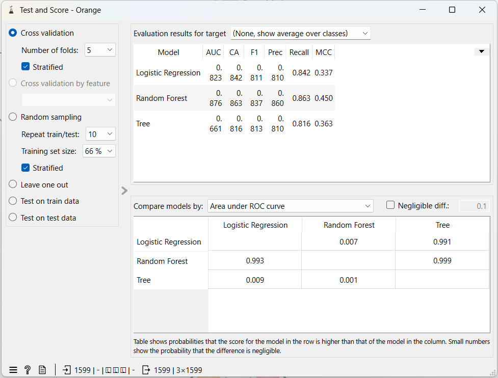
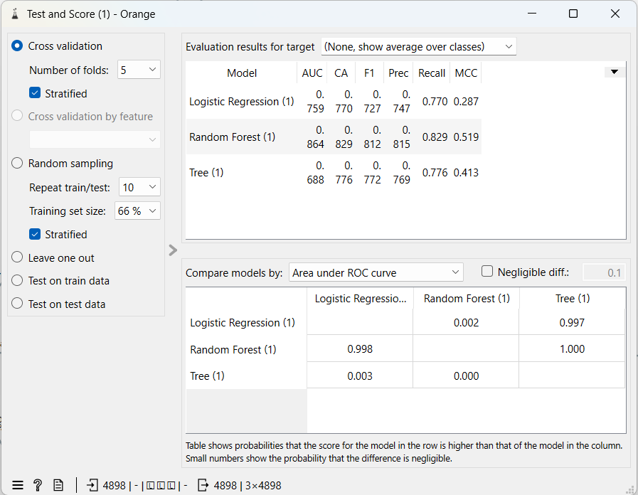
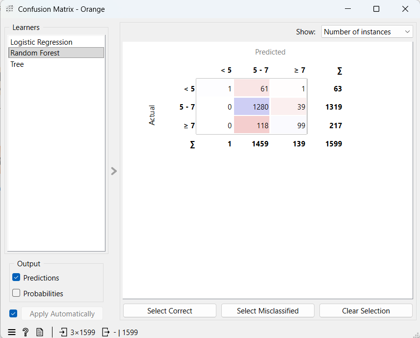
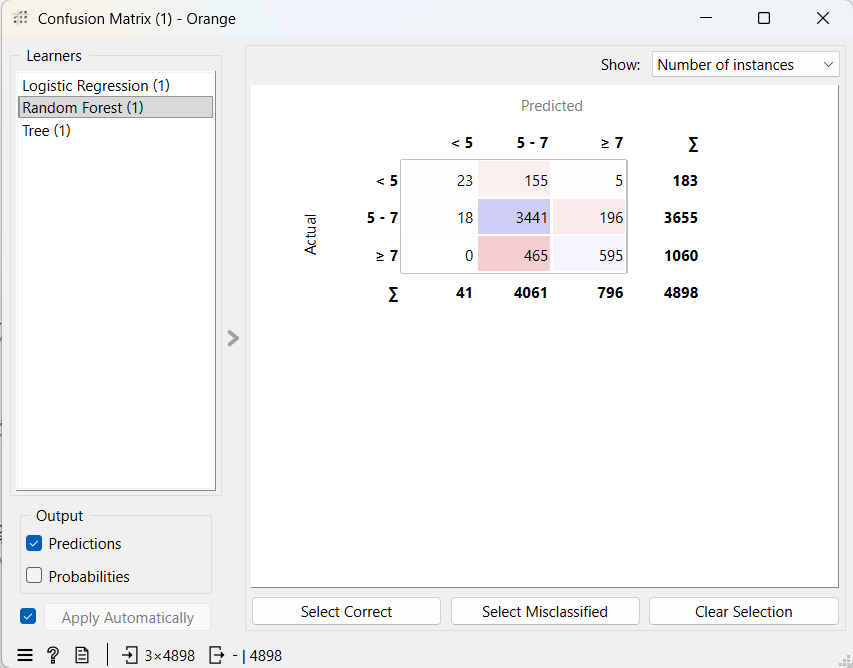
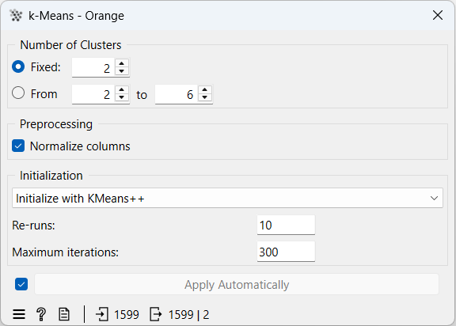
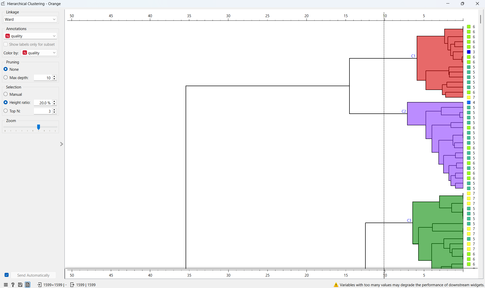

# Wine Quality Classification using Orange

## Project Overview

This project predicts wine quality using machine learning models in Orange Data Mining.  
The goal is to compare the performance of different machine learning algorithms on red and white wine datasets.

The project includes:
- Data preprocessing
- Classification
- Clustering
- Data visualization
- Model evaluation

---

## Dataset

The dataset contains physicochemical properties of Portuguese *Vinho Verde* wines.

### Dataset Information
- Red wine dataset: 1599 samples
- White wine dataset: 4898 samples
- Features: 11 physicochemical attributes
- Target variable: `quality`

### Quality Classes

The original quality scores were discretized into 3 categories:

| Quality Score | Class |
|---|---|
| < 5 | Low Quality |
| 5 - 7 | Medium Quality |
| ≥ 7 | High Quality |

---

## Features Used

The datasets contain the following attributes:

- Fixed acidity
- Volatile acidity
- Citric acid
- Residual sugar
- Chlorides
- Free sulfur dioxide
- Total sulfur dioxide
- Density
- pH
- Sulphates
- Alcohol

---

## Workflow

The following workflow was implemented in Orange:

1. Data loading
2. Data discretization
3. Feature selection
4. Classification
5. Clustering
6. Visualization
7. Model evaluation using cross-validation

---

## Models Used

### Classification Models
- Logistic Regression
- Decision Tree
- Random Forest

### Clustering Techniques
- K-Means Clustering
- Hierarchical Clustering

---

## Results

| Dataset | Best Model | Accuracy |
|---|---|---|
| Red Wine | Random Forest | 0.857 |
| White Wine | Random Forest | 0.829 |

---

## Conclusion

Random Forest achieved the best performance on both datasets.

The red wine dataset achieved slightly higher accuracy than the white wine dataset.

The clustering visualizations also showed clear grouping patterns in wine quality categories.

---

# Screenshots

## Red Wine Workflow

---

## White Wine Workflow

---

## Red Wine Test & Score

---

## White Wine Test & Score

---

## Red Wine Confusion Matrix

---

## White Wine Confusion Matrix

---

## K-Means Clustering Workflow

---

## Hierarchical Clustering Workflow

---

## Project Files

- `wine_quality.ows`
- `winequality-red.csv`
- `winequality-white.csv`
- `winequality.names`
- `Screenshots/`

---

## Dataset Citation

Cortez, P., Cerdeira, A., Almeida, F., Matos, T., & Reis, J. (2009).

*Modeling wine preferences by data mining from physicochemical properties.*

Decision Support Systems, 47(4), 547–553.

DOI: http://dx.doi.org/10.1016/j.dss.2009.05.016

---

## Tools Used

- Orange Data Mining
- GitHub
- Machine Learning Algorithms:
  - Logistic Regression
  - Decision Tree
  - Random Forest
  - K-Means
  - Hierarchical Clustering

---

## Author

Paul Moses
